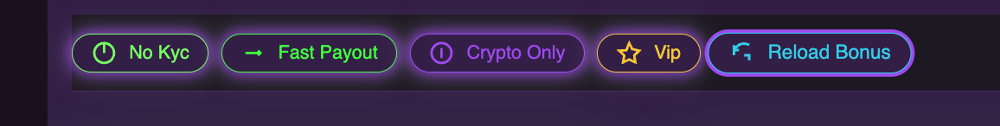

# NEON-CARD-GRID-UI

Dit is een referentie-map voor het opbouwen van een moderne, interactieve, neon-style card grid UI in React/Next.js.

---

## 🎨 Designstijl
- **Naam:** Neon Card Grid UI (ook wel: Vegas Neon Card Dashboard)
- **Kenmerken:**
  - Neon-accenten (groen, paars, geel)
  - Cards in een responsive grid (1-4 kolommen)
  - Micro-interacties: hover-glow, sparkle, glitter, confetti, animated counters
  - Gamification: favorieten, trending, filteren, live search
  - Vegas/casino vibe, maar toepasbaar op elk grid-based overzicht

---

## 📸 Voorbeeld screenshots




---

## 📁 Inhoud van deze map
- `CASINO_UI_README.md` — Uitgebreide uitleg, patterns, codevoorbeelden, design-keuzes
- `screenshot1.png`, `screenshot2.png`, `screenshot3.png` — Voorbeeld van de UI in actie

---

## 🧬 Belangrijkste patterns & technieken

### 1. Card-based grid layout
- Gebruik een responsive grid (Tailwind: `grid-cols-1 sm:grid-cols-2 md:grid-cols-3 lg:grid-cols-4 gap-8`).
- Elke card heeft afgeronde hoeken, schaduw, padding en neon-glow bij hover.

### 2. Neon-glow & animaties
- Gebruik CSS keyframes voor glow, glitter, shine en logo-pop animaties.
- Hover-glow is subtiel (opacity ~0.36, transparante box-shadow).

### 3. Micro-interacties
- Favoriet-knop met scale/kleur animatie, opgeslagen in localStorage.
- Trending/favorites blokken bovenaan, live bijgewerkt.
- Twinkelende ster bij hover over card.
- Confetti bij claim bonus.
- Shimmer skeletons bij laden/filteren.

### 4. Filtering & feedback
- Filterbar met neon pill tags en een opvallende "Show All" knop.
- Live search boven filters.
- Foutmelding met emoji bij geen resultaten.
- AnimatePresence/motion voor smooth fade-in/fade-out van cards.

### 5. Vegas-style achtergrond
- Gebruik `.bg-vegas` class met radial-gradient en subtiele neon-accenten.

### 6. Toegankelijkheid & SEO
- Focus styles (`focus:ring`), aria-labels, en schema.org product markup.
- Responsive en goed leesbaar op mobiel en desktop.

### 7. Packages
- Tailwind CSS, Framer Motion, react-countup, Zustand (optioneel).

Zie het volledige overzicht en codevoorbeelden in `CASINO_UI_README.md`.

---

## 📖 Studie- & Referentiepagina: Neon Card Grid UI

Deze pagina is bedoeld als jouw persoonlijke naslagwerk én leerhulp om:
- Beter te begrijpen hoe moderne grid- en card-based UI's zijn opgebouwd
- Effectief te communiceren met Cascade (of andere ontwikkelaars)
- Zelfverzekerd wensen, feedback en opdrachten te formuleren

---

## 🏆 Waarom deze UI als voorbeeld?
Deze UI bevat veel best practices op het gebied van structuur, animatie, toegankelijkheid en visuele aantrekkingskracht. Door deze als referentie te gebruiken, leer je:
- Hoe je een interactief grid opzet met cards
- Hoe je micro-interacties en animaties toevoegt voor een rijke gebruikerservaring
- Hoe je wensen en feedback helder en concreet kunt formuleren

---

## 🎓 Hoe communiceer je effectief over UI/UX?

### 1. Wees specifiek
- Benoem altijd het element: card, grid, badge, knop, achtergrond, etc.
- Geef context: “op mobiel”, “bij hover”, “voor favorieten”, etc.

### 2. Gebruik visuele en functionele termen
- "Glow minder fel", "badge geel maken", "extra animatie bij klik", "tooltip toevoegen", "responsive maken"

### 3. Geef voorbeelden
- Gebruik de voorbeelden uit deze README of verwijs naar screenshots.

### 4. Benoem je doel
- Wil je meer aandacht trekken? Wil je het rustiger? Wil je het toegankelijker?

### 5. Vraag gerust om suggesties
- Je mag altijd vragen: "Wat zou jij aanraden voor meer Vegas-sfeer?" of "Welke animatie past hier goed bij?"

---

## 📝 Oefeningen & opdrachten

Probeer zelf opdrachten te formuleren met de woorden en patronen uit deze pagina. Voorbeelden:
- "Maak het grid 3-koloms op desktop en 1-koloms op mobiel."
- "Laat de badge 'No KYC' een tooltip tonen bij hover."
- "Voeg een pulserende neon-glow toe aan de favoriet-knop."
- "Laat confetti regenen bij het klikken op 'Claim Bonus'."
- "Maak de achtergrond minder druk op mobiel."

Wil je feedback op je opdrachtformulering? Vraag gerust: "Is dit zo duidelijk geformuleerd?" of "Hoe zou jij deze wens omschrijven?"

---

## 🛠️ Zelf uitbreiden en leren
- Voeg eigen voorbeelden, screenshots en notities toe aan deze pagina.
- Noteer termen of effecten die je mooi vindt uit andere sites.
- Gebruik deze pagina als startpunt voor elk nieuw project met een grid/card-structuur.

---

## 🤝 Samenwerken met Cascade
- Hoe duidelijker je je wens formuleert, hoe sneller en preciezer ik kan bouwen.
- Gebruik deze pagina als geheugensteun voor termen, patronen en voorbeelden.
- Je mag altijd vragen om uitleg, alternatieven of inspiratie.

---

## 📚 Woordenlijst & uitleg

Hieronder vind je veelgebruikte termen en patronen uit deze UI, zodat je makkelijker en gerichter kunt aangeven wat je wilt:

### Grid
- Een grid is een raster van rijen en kolommen waarin cards of andere elementen netjes worden uitgelijnd.
- In deze UI: meestal 1-4 kolommen, responsive via Tailwind (`grid-cols-1 sm:grid-cols-2 md:grid-cols-3 lg:grid-cols-4`).

### Card (kaart)
- Een card is een los "venster" of blokje met informatie (zoals één casino).
- Cards hebben afgeronde hoeken, schaduw, padding, animatie bij hover, en bevatten meestal een logo, titel, rating, badges, knoppen, etc.

### Badge / Tag
- Een badge of tag is een klein label (zoals "No KYC" of "Fast Payout") met een opvallende kleur en soms een icoon.
- In deze UI zijn badges neon pills met animatie en optioneel een tooltip.

### Hover-effect
- Een visueel effect dat verschijnt als je met de muis over een element zweeft.
- Voorbeelden: glow rond de card, logo-pop, twinkelende ster.

### Micro-interactie
- Kleine animatie of feedback bij een actie, zoals een ster die twinkelt, een knop die pulseert, of confetti bij een klik.

### Favoriet
- Een card kan als favoriet worden gemarkeerd (sterretje). Dit wordt opgeslagen in localStorage en visueel benadrukt met animatie.

### Trending
- Cards die vaak worden aangeklikt, krijgen een "trending" label of badge.

### Skeleton loading / shimmer
- Een animatie die aangeeft dat content aan het laden is, vaak als glijdende gradient of bewegende blokken.

### AnimatePresence / motion
- Framer Motion componenten voor animaties bij het in/uit beeld komen van cards (fade-in/fade-out).

### Vegas-flare
- Extra luxe/feestelijke animaties zoals glitter, shine sweep, slotmachine-effecten.

### Responsive
- De UI past zich automatisch aan aan verschillende schermformaten (mobiel, tablet, desktop).

### Toegankelijkheid (a11y)
- Focus styles, aria-labels, duidelijke feedback en goede leesbaarheid voor iedereen.

---

## 💡 Tips om mij beter aan te sturen
- Gebruik termen als "card", "grid", "badge", "hover-effect" of "micro-interactie" als je specifieke onderdelen wilt aanpassen.
- Geef aan hoeveel kolommen je wilt in het grid (bijvoorbeeld: "maak het een 3-koloms grid").
- Geef aan welke animatie je wilt (bijvoorbeeld: "laat de ster twinkelen bij hover" of "maak de glow minder fel").
- Benoem kleuren en accenten: "meer paars", "minder fel groen", "andere achtergrond".
- Geef aan of je iets wilt toevoegen aan alle cards, of alleen aan een selectie (bijvoorbeeld: "alleen favorieten een extra badge").
- Wil je een nieuwe micro-interactie? Beschrijf kort wat het moet doen ("laat muntje omhoog springen bij klik op bonus").
- Geef aan of het mobielvriendelijk moet zijn.

---

## 🎯 Voorbeelden van opdrachten
- "Maak de hover-glow op de cards subtieler."
- "Voeg een tooltip toe aan de 'No KYC' badge."
- "Laat de eerste ster van de rating twinkelen bij hover."
- "Zet het grid op 3 kolommen op desktop."
- "Voeg een Vegas-style shine sweep toe over het logo bij hover."
- "Voeg een trending-badge toe aan de top 3 meest geklikte cards."
- "Maak de favoriet-knop geel en laat hem pulseren bij klik."
- "Laat de achtergrond langzaam pulseren met neon-licht."

---

## 🛠️ Extra: Tailwind config en kleuren

```js
// tailwind.config.ts
const config = {
  theme: {
    extend: {
      colors: {
        background: '#18181b',
        primary: '#38FF14',
        accent: '#A855F7',
      },
      fontFamily: {
        heading: ['Montserrat', 'sans-serif'],
        body: ['Inter', 'sans-serif'],
      },
    },
  },
};
export default config;
```

---

## 📦 Gebruikte packages
- **Next.js** (of React)
- **Tailwind CSS** (utility-first styling)
- **Framer Motion** (animaties)
- **react-countup** (animated counters)
- **Zustand** (optioneel, state management)

---

## 📋 Snel hergebruiken
- Kopieer componenten, CSS en patterns uit deze map.
- Gebruik de woordenlijst en voorbeelden om gericht aanpassingen te vragen.
- Voeg je eigen wensen, kleuren of animaties toe voor een uniek resultaat.

---

## 📜 Ontstaansgeschiedenis & aanpak

Deze UI is tot stand gekomen door stapsgewijze iteratie, telkens op basis van feedback, inspiratie en UX-wensen. Hieronder het proces en de keuzes die belangrijk zijn voor hergebruik:

### 1. Startpunt
- Begonnen met een eenvoudig grid van casino-cards in Next.js + Tailwind.
- Snel gekozen voor een neon/vegas-thema met veel accentkleuren en animatie.

### 2. Visuele opbouw
- Cards kregen afgeronde hoeken, schaduw, neon-glow en een Vegas-style achtergrond.
- Elk element kreeg een eigen micro-interactie: hover-glow, logo-pop, twinkelende ster, glitter, confetti.
- De glow is bewust subtiel gehouden voor leesbaarheid.

### 3. Gamification & interactie
- Toevoeging van favorieten (met localStorage), trending (op basis van clicks), animated counters, confetti bij claim.
- Live search en filteren op badges/tags.
- Trending/favorites blokken boven het grid voor extra engagement.

### 4. UX & toegankelijkheid
- Focus styles, aria-labels, en duidelijke feedback bij geen resultaten.
- Alles responsive gemaakt, van mobiel tot groot scherm.
- AnimatePresence/motion voor smooth fade-in/fade-out.

### 5. Luxe & Vegas-flare
- Vegas-glitter, shine sweep, animated badges, coin toss, slotmachine-ideeën.
- Achtergrond met radial-gradient, subtiele neon-edges.

### 6. Documentatie & overdraagbaarheid
- Alle patterns, keuzes en codevoorbeelden vastgelegd in deze map en de CASINO_UI_README.md.
- Screenshots toegevoegd voor visuele referentie.
- Designstijl benoemd als "Neon Card Grid UI".

### 7. Hergebruik
- Deze aanpak is breed toepasbaar: elk grid-based overzicht, dashboard of vergelijker kan deze patterns gebruiken.
- Door de README en codevoorbeelden kan dit snel worden overgenomen in nieuwe projecten.

---

## 📋 Gebruik
- Gebruik deze map als inspiratie of basis voor nieuwe projecten met een vergelijkbare stijl.
- Verwijs in een nieuw project naar deze map en README voor consistente UI/UX.
- Voeg je eigen screenshots of varianten toe als je de stijl aanpast.

---

**Vragen of uitbreidingen nodig? Laat het gerust weten!**
